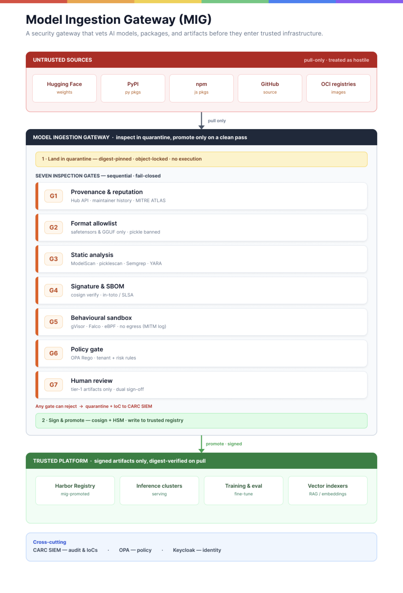
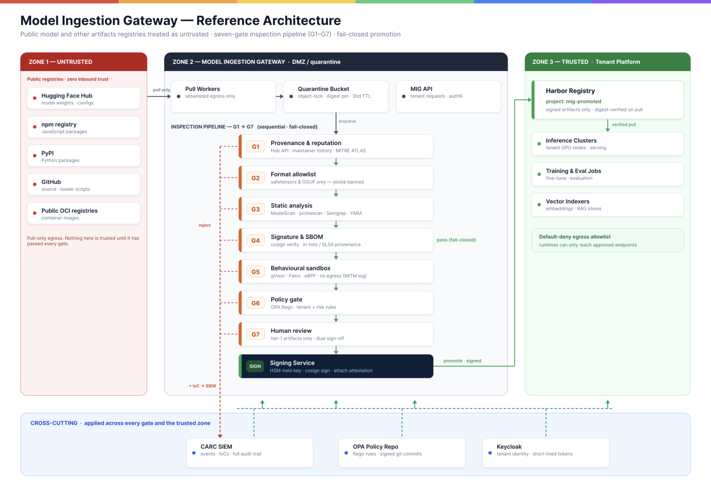

# MIG — Model Ingestion Gateway

> Vet AI models, packages, and artifacts **before** they enter trusted infrastructure.

MIG is a pure-Python, embeddable library that treats public sources (Hugging
Face, GitHub, PyPI, npm, OCI registries) as **untrusted** and runs every artifact
through a composable, **fail-closed** gate pipeline that lands it in quarantine,
inspects it, and produces a **categorical, type-aware verdict** plus a **signed
attestation** — the traceability artifact for compliance (EU AI Act / NIS2 / GxP).
Nothing reaches trusted infrastructure until it has passed every gate and been
**signed and promoted** through a separate, gated step.

It ships as a library so the same vetting logic runs as a CLI, a CI gate, a
Kubernetes admission controller, or an embedded guard inside an agent/MLOps
platform — without coupling to any one deployment.

The **core is stdlib-only** (zero runtime dependencies); every integration is an
opt-in extra. Apache-2.0.

<p align="center">
  
</p>

## Reference architecture

Public registries are Zone 1 (untrusted, pull-only). The gateway (Zone 2) is a
quarantined DMZ running a sequential, fail-closed inspection pipeline; only a
clean pass is signed and promoted into the trusted platform (Zone 3).



> The diagram is the **reference deployment architecture**. This repository is the
> **gateway core** — it implements the quarantine, gates **G2–G6**, the signed
> attestation, and the gated promotion. **G1** (provenance/reputation) and **G7**
> (human review) are integration points the categorical verdict routes to
> (`review_required`); Harbor / Keycloak / SIEM are reference deployment
> components MIG produces signed evidence for, not parts of the library.

| Reference gate | MIG implementation | Module / command |
|---|---|---|
| G2 · Format allowlist | safetensors/GGUF allow, pickle weights rejected | `gates/format_allowlist` |
| G3 · Static analysis | picklescan + AST static-code + secrets + license + prompt-injection | `gates/*` |
| G4 · Signature & attestation | in-toto Statement v1 + DSSE (HMAC / ed25519 / cosign) | `mig ingest` / `verify` |
| G5 · Behavioural sandbox | confined Docker / gVisor detonation, egress-blocked | `sandbox/docker` |
| G6 · Policy gate | declarative safety-floor engine; OPA at promotion | `policy/` · `promotion/` |
| Sign & promote | gated, content-addressed write into the trusted store | `mig promote` |

## Worked example

A clean safetensors model, end to end. (The banner is stderr-only and
TTY-gated; pipe stdout and you get clean JSON. Set `MIG_NO_BANNER=1` to silence it.)

### 1 · Scan — decision-only verdict

```console
$ mig scan ./sentiment-model
```
```jsonc
{
  "artifact_type": "model",
  "gate_results": [
    { "gate_id": "format_allowlist", "status": "pass", "rigor": "static",
      "scanner_name": "mig.format_allowlist", "scanner_version": "0.1.0.dev0",
      "evidence": { "allowed_weight_files": ["model.safetensors"], "unsafe_weight_files": [] } },
    { "gate_id": "digest", "status": "pass",
      "evidence": { "digest": "sha256:96fc78750744eb81520be011be3f84265bc345f384481102b69551647a53205e" } },
    { "gate_id": "serialization_safety", "status": "pass", "scanner_name": "picklescan", "scanner_version": "1.0.4" },
    /* secrets · license_metadata · static_code · prompt_injection → all pass */
    { "gate_id": "behavioral", "status": "skipped", "rigor": "none",
      "findings": [ { "severity": 3, "code": "behavioral_analysis_skipped",
        "message": "Behavioral analysis was SKIPPED: the configured sandbox is NoopSandbox ... Do not treat any APPROVE as behaviorally vetted (I7/I8)." } ],
      "scanner_name": "sandbox:noop" }
  ],
  "decision": "approve"
}
```

The default `NoopSandbox` emits a **loud `SKIPPED`** (I7) — an APPROVE is never
silently "behaviorally vetted". Scan the *same* artifact as an executable type and
it can never auto-approve at static-only rigor (I8):

```console
$ mig scan ./sentiment-model --type mcp_server --compact
{... "decision": "review_required"}
```

A **malicious** artifact (a pickle weight that runs `os.system` on load) is
rejected — `--fail-on reject` makes the exit code non-zero for CI:

```console
$ mig scan ./evil-model --fail-on reject
```
```json
{
  "decision": "reject",
  "findings": [
    { "gate": "format_allowlist",      "code": "unsafe_serialization_format", "sev": 4 },
    { "gate": "serialization_safety",  "code": "unsafe_pickle_global",        "sev": 4 }
  ]
}
```

### 2 · Ingest — produce a signed attestation

```console
$ export MIG_SIGNING_KEY=$(openssl rand -hex 32)
$ mig ingest ./sentiment-model --out model.dsse.json
```

The output is a [DSSE](https://github.com/secure-systems-lab/dsse) envelope whose
payload is an [in-toto Statement v1](https://github.com/in-toto/attestation); the
signature is over the canonical-JSON PAE, and the artifact digest is the
**Statement subject** (inside the signed bytes):

```jsonc
// model.dsse.json
{ "payloadType": "application/vnd.in-toto+json",
  "payload": "eyJfdHlwZSI6Imh0dHBzOi8vaW4tdG90by5pby9TdGF0ZW1lbnQvdjEi...",
  "signatures": [ { "keyid": "3b7498245244a4db", "scheme": "hmac-sha256", "sig": "wHRyKIWruSUiYCs8..." } ] }

// base64-decoded payload (the signed in-toto Statement):
{ "_type": "https://in-toto.io/Statement/v1",
  "predicateType": "https://mig.dev/attestation/vetting/v1",
  "subject": [ { "name": "local:///sentiment-model",
                 "digest": { "sha256": "96fc78750744eb81520be011be3f84265bc345f384481102b69551647a53205e" } } ],
  "predicate": { "decision": "approve", "overall_rigor": "static", "confinement_level": "noop",
                 "gate_summary": [ /* every gate: status + rigor + scanner_name + scanner_version (I5) */ ] } }
```

### 3 · Verify — re-check signature, re-bind digest, fail closed

```console
$ mig verify ./sentiment-model --attestation model.dsse.json --compact
{"ok": true, "scheme": "hmac-sha256", "keyid": "3b7498245244a4db", "decision": "approve",
 "checks": {"signature": true, "digest_rebind": true, "attribution": true, "keyid": true},
 "warning": "integrity-only (shared-secret HMAC), NOT third-party provenance — use ed25519/cosign across a trust boundary"}
# exit 0
```

Tamper with one byte of the artifact and verify **fails closed** — the live
re-hash no longer matches the attested subject (I3), and the exit code is `3`
(verification failure, distinct from an operator error):

```console
$ echo '{"model_type":"BACKDOORED"}' > ./sentiment-model/config.json
$ mig verify ./sentiment-model --attestation model.dsse.json --compact
{"ok": false, ... "checks": {"signature": true, "digest_rebind": false, "attribution": true, "keyid": true},
 "problems": ["digest mismatch: live sha256:cdb324... != attested sha256:96fc78..."]}
# exit 3
```

### 4 · Promote — the gated write into the trusted store

`mig promote` re-verifies the signed attestation, runs the **embedded safety
floor AND** (optionally) OPA under **deny-overrides**, then writes atomically into
a content-addressed store and audits the attempt:

```console
$ mig promote ./sentiment-model --attestation model.dsse.json --store-root ./trusted --compact
2026-06-21 ... INFO mig.promotion promotion promoted: digest=sha256:96fc78...
{"ok": true, "outcome": "promoted", "store_uri": "mig-trusted://sha256/96fc78...",
 "decision": "approve", "gate": {"allow": true, "engine": "embedded", "reasons": []},
 "verification": {"ok": true, "checks": {"signature": true, "digest_rebind": true, "attribution": true, "keyid": true}}}
# exit 0
```
```console
$ find ./trusted -type f
./trusted/cas/sha256/96/96fc78…/.complete            # commit marker, written last
./trusted/cas/sha256/96/96fc78…/artifact/config.json
./trusted/cas/sha256/96/96fc78…/artifact/model.safetensors
./trusted/cas/sha256/96/96fc78…/attestation.dsse.json   # the signed envelope
./trusted/cas/sha256/96/96fc78…/receipt.json
./trusted/index/promotions.jsonl                     # append-only audit trail
```

Promoting a tampered artifact fails verification (exit 3); promoting a `reject` /
`review_required` attestation is denied by the floor (exit 1). The same digest
re-promotes idempotently. Exit codes: `0` promoted/idempotent · `1` policy denied
· `2` operator error · `3` verification failure.

## CLI

```
mig scan <ref>            decision-only verdict (JSON)                       --policy --fail-on --sandbox
mig manifest <ref>        files + content digest
mig policy test <ref>     evaluate a policy against an artifact              --policy
mig ingest <ref>          fetch + scan + sign a DSSE attestation            --signer --key --out --bundle
mig verify <ref>          re-check signature + re-bind digest + attribution --attestation --signer --key
mig evidence <ref>        emit a full signed evidence bundle                --out
mig promote <ref>         gated write into the trusted store                --attestation --store-root --opa
```

## Using MIG as a library (Python)

MIG is a library first — the CLI is a thin wrapper. Embed the same vetting logic
in a CI step, a Kubernetes admission webhook, or an agent/MLOps guard. The
snippets below run against the real API and the inline comments show their actual
output (the Docker example needs a daemon and is illustrative).

### Scan an artifact and read the verdict

```python
from mig import make_context, run_pipeline
from mig.core.artifact import ArtifactRef
from mig.gates import default_gates
from mig.policy.schema import Policy
from mig.sources.local import LocalSource
from mig.storage.quarantine import Quarantine

quarantine = Quarantine(root="/tmp/mig-q")
ref = ArtifactRef(scheme="local", locator="./sentiment-model")
artifact = LocalSource().fetch(ref, quarantine)        # digest-pinned into quarantine (I3)

ctx = make_context(policy=Policy(id="default", version="1"), quarantine=quarantine)
verdict = run_pipeline(artifact, default_gates(), ctx)

print(verdict.decision.value)        # 'approve'
print(verdict.rigor_summary().value) # 'static'
print(artifact.digest)               # 'sha256:96fc78750744eb81520be011be3f84265bc345f384481102b69551647a53205e'
print(verdict.behavioral_ran())      # False  (default NoopSandbox — loud SKIPPED, I7)
```

### Apply a stricter policy (a safety floor — rules can only escalate)

```python
from mig.policy.schema import Policy, PolicyRule, PolicyAction
from mig.core.verdict import Severity

policy = Policy(id="strict-prod", version="2", rules=(
    PolicyRule(id="require-license", when={"finding.code_in": ["no_license"]},
               action=PolicyAction.REQUIRE_REVIEW, severity=Severity.LOW),
))
verdict = run_pipeline(artifact, default_gates(), make_context(policy=policy, quarantine=quarantine))
print(verdict.decision.value)        # 'review_required'  (escalated; never downgraded)
```

`when` supports `artifact.type` / `artifact.type_in` / `artifact.file_ext_in` /
`artifact.format_not_in` / `rigor_below` / `finding.code` / `finding.code_in` /
`finding.severity_at_least` / `gate_failed`. Or load one from YAML/JSON with
`mig.policy.loader.load_policy("policy.yaml")` (`mig[policy]` for YAML).

### Add your own gate (just match the `Gate` protocol)

```python
from mig.core.artifact import ArtifactType
from mig.core.verdict import GateCost, GateResult, GateStatus, RigorLevel

class WeightSizeGate:
    id = "weight_size"
    cost = GateCost.CHEAP                       # CHEAP → MEDIUM → EXPENSIVE ordering
    applies_to = frozenset(ArtifactType)        # which artifact types it runs on

    def evaluate(self, artifact, ctx) -> GateResult:
        weights = [f for f in artifact.files if f.endswith(".safetensors")]
        return GateResult(gate_id=self.id, status=GateStatus.PASS, rigor=RigorLevel.STATIC,
                          scanner_name="example.weight_size", scanner_version="1",
                          evidence={"weight_files": weights})

verdict = run_pipeline(artifact, [*default_gates(), WeightSizeGate()], ctx)
```

### Use a real behavioural sandbox (Docker / gVisor)

```python
from mig.sandbox.docker import DockerSandbox

# Detonate executable types under confinement (--network none, read-only, caps
# dropped, non-root). Needs the `docker` binary; runtime="runsc" selects gVisor.
ctx = make_context(policy=Policy(id="default", version="1"), quarantine=quarantine,
                   sandbox=DockerSandbox(runtime="runsc"))
verdict = run_pipeline(mcp_server_artifact, default_gates(), ctx)
# now the behavioral gate runs at BEHAVIORAL rigor → an executable type can APPROVE (I8)
```

### Build, sign, and verify an attestation

```python
import os
from mig.evidence.builder import build_attestation
from mig.evidence.statement import statement_from_attestation
from mig.evidence.signing import (HMACSigner, HMACVerifier, sign_statement,
                                   verify_envelope, VerificationError)

key = os.urandom(32)                                # or load an ed25519 key (mig[signing])
attestation = build_attestation(verdict, artifact, policy=policy, mig_version="1.0",
                                confinement_level="noop",
                                created_at="2026-06-21T00:00:00Z")   # refuses under-attributed vetting (I5)
envelope = sign_statement(statement_from_attestation(attestation), HMACSigner(key))

statement = verify_envelope(envelope, HMACVerifier(key))             # raises on any tamper
print(statement["predicate"]["decision"])           # 'approve'
try:
    verify_envelope(envelope, HMACVerifier(b"x" * 32))               # wrong key
except VerificationError:
    print("rejected")                               # 'rejected'
```

### Gate a promotion into the trusted store

```python
import json
from mig.evidence.dsse import encode_envelope
from mig.evidence.signing import make_verifier
from mig.promotion import promote_artifact, make_promotion_gate, make_trusted_store
from mig.promotion.audit import PromotionAuditSink

with open("att.dsse.json", "w") as fh:
    json.dump(encode_envelope(envelope), fh)

result = promote_artifact(
    ref,
    attestation_path="att.dsse.json",
    verifier=make_verifier("hmac", key_bytes=key),
    store=make_trusted_store("local", root="./trusted"),
    gate=make_promotion_gate(),                      # embedded floor (offline); add opa="cli" for OPA
    source=LocalSource(),
    audit=PromotionAuditSink("./trusted"),
    mig_version="1.0",
)
print(result.outcome, result.exit_code, result.store_uri)
# promoted 0 mig-trusted://sha256/96fc78750744eb81520be011be3f84265bc345f384481102b69551647a53205e
```

`promote_artifact` re-runs verification and the deny-overrides gate *before* the
single store write, and never raises — it returns a `PromotionResult` with the
contract exit code (`0/1/2/3`) and always audits the attempt.

## Design invariants (non-negotiable — encoded as tests)

| # | Invariant |
|---|---|
| I1 | Static gates never import / `exec` / deserialize an artifact in-process. |
| I2 | Format headers are parsed without deserializing tensor data, hardened against adversarial input. |
| I3 | Sources pin + verify the digest/SHA at fetch and land bytes in **quarantine**. |
| I4 | The verdict is **categorical and type-aware** — never a bare bool or score threshold. |
| I5 | Every attestation encodes per-gate status + rigor + scanner version, plus overall confinement. |
| I6 | `ingest()` stops at the decision; `promote()` is a separate, gated call (and the only trusted-store writer). |
| I7 | The default `NoopSandbox` emits a **loud** `SKIPPED` behavioral result. |
| I8 | Executable artifact types can't be `APPROVE`d at static-only rigor. |
| I9 | Prompt-injection inspection is a **WARN** signal, never a hard reject. |
| I10 | MIG's own dependencies are pinned, hash-checked, minimal, and audited. |

## Signing & promotion backends

The core path is stdlib-only and works offline/airgapped. Stronger backends are
opt-in and drive host CLIs (no Python dependency):

| Purpose | Default (stdlib) | Opt-in |
|---|---|---|
| Attestation signing | HMAC-SHA256 (`--signer hmac`) — integrity-only | `ed25519` (`mig[signing]`) · `cosign` binary |
| Behavioural sandbox | `NoopSandbox` (loud SKIPPED) | Docker / gVisor (`docker` binary) |
| Promotion policy | embedded safety floor | OPA (`mig[opa]`, `opa` binary) — **deny-overrides only** |
| Trusted store | local content-addressed filesystem | `s3` / `harbor` (reserved) |
| Fetch sources | local path | Hugging Face (`mig[huggingface]`) |
| Scanners | — | picklescan (`mig[scanners]`) |
| Policy files | JSON | YAML (`mig[policy]`) |

## Development

Requires Python ≥ 3.11 and [uv](https://docs.astral.sh/uv/).

```bash
uv sync                 # create the env from the locked, hashed dep set
uv run pytest           # tests (279 passing)
uv run mypy             # strict type-check
uv run ruff check .     # lint
uv run ruff format .    # format
```

CI (`.github/workflows/ci.yml`) runs all four checks on Python 3.11–3.13 plus a
build·smoke job, on every PR.

## Build plan

Built one PR at a time; each PR leaves the system green and exercisable. The
system stays decision-only until PR8 introduces gated promotion. **All landed:**

- **PR1** — Core contracts & scaffolding ✓
- **PR2** — Pipeline runner + walking skeleton (`mig scan` end-to-end) ✓
- **PR3** — Quarantine + digest-pinned fetch + Hugging Face source ✓
- **PR4** — Static scanner suite (picklescan, AST static-code, secrets, license, prompt-injection) ✓
- **PR5** — Declarative policy engine (`--policy` / `--fail-on` / `mig policy test`) ✓
- **PR6** — Behavioral sandbox (Docker → gVisor) ✓
- **PR7** — Attestation & signing (in-toto Statement + DSSE; HMAC / ed25519 / cosign) ✓
- **PR8** — Gated trusted-store promotion (embedded floor + OPA deny-overrides) ✓

## License

Licensed under the [Apache License 2.0](LICENSE).
